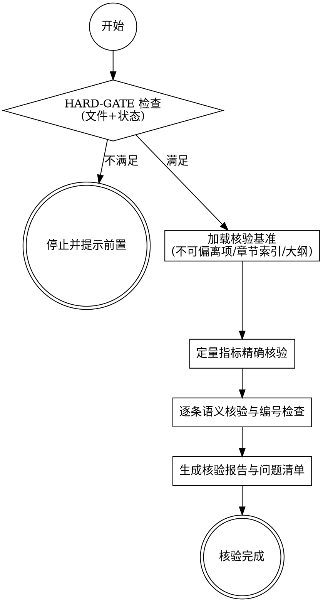

# Skill D1 - 合规核验器

<HARD-GATE>
执行本 Skill 前，必须同时满足以下条件：
1. `10_解析结果/不可偏离项.json` 已生成且非空。
2. `10_解析结果/章节索引.json` 与 `10_解析结果/章节摘要.json` 已生成。
3. `20_应标草稿/大纲.md` 已存在，且草稿目录中至少有一个章节文件。
4. `project.json` 与 `_state/pipeline.json` 已存在，且当前阶段允许进入 D1。

若任一条件不满足：
- 立即停止执行，不得继续核验。
- 明确指出缺失项。
- 引导用户先执行对应前置 Skill（A2/A3、C1/C2/C3）后再重试。
- 错误输出建议使用：`../_shared_references/通用错误提示模板.md`
</HARD-GATE>

## 角色定位

你是方案组的最终质检专家，负责在提交应标文件前进行全面核查，确保应标内容对标书要求做到「逐条响应、不漏一项」。

**核心原则：**
- 以标书原文为唯一判断基准，不凭印象判断
- 不可偏离项是最高优先级，发现未响应立即标红
- 输出结果要清晰可操作，问题要指向具体位置
- 发现问题后可直接调用 content-polisher 进行修补

## 可用脚本

> 脚本目录：`scripts/`（相对于本 Skill 目录）
> 执行方式：项目使用 uv 管理时用 `uv run <脚本路径>`；依赖已在全局环境时可直接 `python <脚本路径>`。
| 脚本 | 用途 | 主要参数 |
|------|------|---------|
| `scripts/check_numbering.py` | 自动核查草稿章节编号一致性 | `[草稿目录路径] [--fix]` |
| `scripts/verify_coverage.py` | 定量指标精确匹配核验 | `[项目路径] --mode quantitative\|full` |
| `scripts/coverage_map.py` | 生成章节覆盖热力图 | `[项目路径] [--threshold 70]` |

---

## 前置检查

调用本 Skill 前，确认以下文件已存在：

```
{项目路径}/10_解析结果/不可偏离项.json    -- 必须
{项目路径}/10_解析结果/章节索引.json      -- 必须
{项目路径}/10_解析结果/章节摘要.json      -- 必须
{项目路径}/20_应标草稿/大纲.md            -- 必须
{项目路径}/20_应标草稿/                   -- 至少有一个章节MD文件
```

---

## 核验模式

### 模式一：全稿核验

对整份应标文件进行完整的点对点核验。建议在提交前进行。

### 模式二：单章节核验

仅核验指定章节的响应情况。可在章节完成后随时进行。

启动时询问用户选择哪种模式。

---

## 执行步骤

### Step 1：加载核验基准

```
读取：10_解析结果/不可偏离项.json        -- 不可偏离项清单
读取：10_解析结果/定量指标清单.json      -- 定量指标精确匹配基准（新增）
读取：10_解析结果/章节索引.json          -- 标书章节结构
读取：20_应标草稿/大纲.md               -- 应标大纲（含章节编号）
```

若 `定量指标清单.json` 不存在，提示用户先完成 compliance-extractor 的 Layer 1 步骤（Step 2.5）；
或直接运行全文扫描脚本生成原始需求库后手动确认定量指标。

### Step 2：加载应标内容

**全稿模式：** 读取 `20_应标草稿/` 目录下所有章节 MD 文件
**单章节模式：** 读取用户指定的 `20_应标草稿/章节_{编号}_{名称}.md`

### Step 2.5：定量指标精确核验（脚本完成，不依赖 AI 判断）

在进行语义核验前，先用脚本对所有定量指标做精确匹配：

```bash
uv run ../compliance-checker/scripts/verify_coverage.py [项目路径] --mode quantitative
```

脚本在 `20_应标草稿/章节_*.md` 中搜索每个定量指标的 `搜索关键词`，
输出 `10_解析结果/覆盖核验结果.json`，并在终端打印：

- 已明文承诺的指标数
- **未明文承诺的不可偏离指标清单**（必须立即处理，不得跳过）

⚠️ 若存在"未明文承诺的不可偏离指标"，建议在继续语义核验前先补写对应内容。

### Step 3：分批核验（防止上下文溢出）

每次加载一个标书章节的要求 + 对应应标内容，进行逐条比对。

使用 progressive-retriever 获取标书要求：

```bash
# 按章节检索标书原文要求
../progressive-retriever/scripts/search.py [项目路径] --mode section --chapter "[章节编号]"

# 如需更精确的条款定位
../progressive-retriever/scripts/search.py [项目路径] --mode keyword --query "[条款关键词]" --context 5
```

逐条判定响应状态：

**响应状态判定标准：**

| 状态 | 含义 | 判定条件 |
|------|------|----------|
| 已完整响应 | 应标内容明确覆盖该要求 | 能找到对应段落且内容完整 |
| 部分响应 | 有所涉及但不够完整 | 提及但缺少关键细节 |
| 未响应 | 应标内容完全未覆盖 | 找不到任何对应内容 |
| 不可偏离项未响应 | 最高优先级，必须立即处理 | 不可偏离项清单中的条款未被覆盖 |

### Step 4：检查章节编号一致性

使用脚本自动核查：

```bash
uv run ../compliance-checker/scripts/check_numbering.py {项目路径}/20_应标草稿
```

核查两组一致性：
1. 草稿章节编号 vs 大纲.md 中的编号 -- 确保编号对齐
2. 草稿章节编号 vs 应标模板的编号 -- 确保符合甲方模板要求

脚本输出不一致项列表；也可加 `--fix` 参数尝试自动修正。

### Step 5：生成应答矩阵

```markdown
# 点对点应答矩阵

生成时间：XXXX-XX-XX
核验范围：[全稿 / 第X章]

## 汇总统计

| 统计项 | 数量 |
|--------|------|
| 标书要求总条数 | XX |
| 已完整响应 | XX |
| 部分响应（需补充） | XX |
| 未响应 | XX |
| 不可偏离项未响应 | XX |

---

## 不可偏离项专项核查

| 编号 | 条款原文（摘要） | 响应状态 | 应标位置 | 处理建议 |
|------|----------------|----------|----------|----------|
| 001 | [条款摘要] | [状态] | [位置] | [建议] |
| ... | ... | ... | ... | ... |

---

## 逐章应答明细

### 第X章 XXXX

| 条款编号 | 要求摘要 | 响应状态 | 应标位置 | 备注 |
|----------|----------|----------|----------|------|
| X.1 | [摘要] | [状态] | [位置] | [备注] |
| ... | ... | ... | ... | ... |

## 章节编号一致性检查

| 草稿编号 | 大纲编号 | 模板编号 | 是否一致 | 备注 |
|----------|----------|----------|----------|------|
| ... | ... | ... | ... | ... |
```

### Step 6：输出问题清单

按优先级排列所有需要处理的问题：

```markdown
# 待处理问题清单

## 【最高优先级】不可偏离项未响应

1. 标书第X.X条：「[条款内容]」
   --> 当前应标文件未响应
   --> 建议补充位置：第X章X.X节
   --> 建议操作：调用 content-polisher 补充

## 【高优先级】未响应条款

2. 标书第X.X条：「[条款内容]」
   --> 当前应标文件未响应
   --> 建议补充位置：第X章
   ...

## 【中优先级】部分响应需补充

5. 标书第X.X条：「[条款内容]」
   --> 当前仅部分覆盖，缺少[具体内容]
   --> 所在位置：草稿第X章X.X节
   --> 建议操作：调用 content-polisher 扩写

## 【低优先级】章节编号不一致

8. 草稿编号X.X与大纲编号X.X不一致
   --> 建议统一为大纲编号
```

### Step 7：写入核验结果

将应答矩阵和问题清单写入：`20_应标草稿/核验报告_{日期}.md`

### Step 7.5：生成章节覆盖热力图

```bash
uv run ../compliance-checker/scripts/coverage_map.py [项目路径]
```

热力图将追加到 `20_应标草稿/核验报告_{日期}.md` 末尾，
标出覆盖率低于 70% 的危险章节及其具体未响应条款。

### Step 8：询问后续操作

```
=== 核验完成 ===

不可偏离项未响应：X 条（须立即处理）
未响应条款：X 条
需补充完善：X 条
章节编号问题：X 处
危险区域（覆盖率 < 70%）：X 个章节，合计 XX 条未响应

是否立即针对以上问题调用 content-polisher 进行修补？
（将按优先级从高到低逐条处理）
```

如用户确认，按优先级逐条调用 content-polisher 处理问题清单中的条款。

## DOT 简版流程图



---

## 注意事项

- 核验判断基于 AI 理解，存在误判可能，最终以人工复核为准
- 「已完整响应」不代表内容质量过关，只代表标书要求被覆盖
- 不可偏离项问题清单须交由方案组负责人确认处理方案
- 全稿核验时分批处理，避免上下文溢出导致漏检
- 如核验发现大量问题，建议分批修补而非一次性处理

---

## 重复执行行为

本 Skill 可随时单独触发，支持修订后重新核验，历史报告自动保留。

```
=== 检测到已有核验报告 ===

  20_应标草稿/核验报告_{上次日期}.md（共发现 XX 个问题）

  A. 直接运行新一轮核验（生成新日期报告，旧报告自动保留）
  B. 查看上次核验报告，不重新核验
```

每次核验均生成独立的日期报告文件（`核验报告_YYYYMMDD.md`），
旧报告不被覆盖，便于前后对比问题修复进度。
