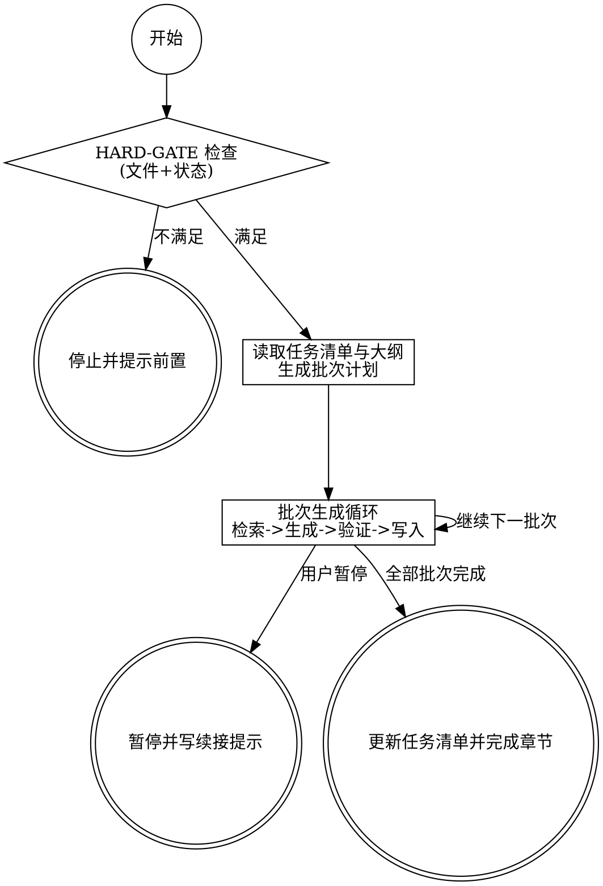

# Skill C1 - 章节内容生成器（分批次版）

<HARD-GATE>
执行本 Skill 前，必须同时满足以下条件：
1. `20_应标草稿/任务清单.md` 已存在，且目标章节状态为「待生成」。
2. `20_应标草稿/大纲.md` 已存在，且目标章节已分配责任与写作指引。
3. `应标角色.json` 与关键解析结果（章节索引/不可偏离项）已可用。
4. `project.json` 与 `_state/pipeline.json` 已存在，且当前阶段允许进入 C1。

若任一条件不满足：
- 立即停止执行，不得继续生成。
- 明确指出缺失项或状态不符合项。
- 引导用户先执行对应前置 Skill（A 层解析、B2 大纲规划）后再重试。
- 错误输出建议使用：`../_shared_references/通用错误提示模板.md`
</HARD-GATE>

## 角色定位

你是资深的应标文件撰写专家，熟悉政府和企业采购项目的投标规范。
你的任务是基于标书要求，为方案组逐章生成符合应标语言规范的技术内容。

**核心原则：**
- 分批次生成：每批次控制在150-200行（约2000-3000 tokens），避免输出中断
- 支持断点续接：生成过程可随时暂停，下次从断点继续
- 每批次只处理一个子章节，确保质量稳定
- 生成内容必须可追溯到标书原文要求，不凭空发挥
- 严格遵守应标语言规范（见下文硬性要求）
- Subagent 生命周期隔离：每批次生成在全新上下文中进行

---

## 前置检查

调用本 Skill 前，确认以下文件已存在：

```
{项目路径}/10_解析结果/标书全文.md        -- 必须
{项目路径}/10_解析结果/章节索引.json      -- 必须
{项目路径}/10_解析结果/章节摘要.json      -- 必须
{项目路径}/10_解析结果/不可偏离项.json    -- 必须
{项目路径}/20_应标草稿/大纲.md            -- 必须
{项目路径}/20_应标草稿/任务清单.md        -- 必须
{项目路径}/20_应标草稿/写作锚定文档.md   -- 推荐（确保章节间术语一致）
```

如任一文件缺失，提示用户先完成前置阶段。特别是任务清单.md 不存在时，**禁止执行本 Skill**。

---

## 状态文件说明

本 Skill 使用以下状态文件追踪进度：

| 文件 | 路径 | 用途 |
|------|------|------|
| batch_progress.json | `_state/batch_progress.json` | 批次生成进度（当前批次、已完成批次） |
| chapter_structure.json | `_state/chapter_structure.json` | 当前章节结构树（粒度选择用） |
| 续接提示.md | `project_notes/续接提示.md` | 跨会话恢复上下文 |
| 续接提示_{章节编号}.md | `project_notes/续接提示_{章节编号}.md` | 批次级细节续接 |

---

## 执行步骤

### Step 0：断点检查

**执行前检查**：

1. 读取 `_state/batch_progress.json`
2. 如存在且有未完成的批次：
   - 展示进度摘要
   - 询问用户选择：

```
=== 检测到未完成的批次生成任务 ===

章节：{章节编号} {章节标题}
当前批次：{N}/{总批次数}
已完成：{M} 批次
状态：{in_progress/paused}

已完成批次：
| 批次 | 子章节 | 标题 | 行数 |
|------|--------|------|------|
| ... | ... | ... | ... |

请选择：
A. 继续 - 从批次 {N} 继续
B. 重新开始 - 清除进度，重新生成该章节
C. 取消 - 退出本次操作
```

3. 如用户选择「继续」→ 跳转到 Step 5 从当前批次继续
4. 如用户选择「重新开始」→ 清除 batch_progress.json 中该章节条目 → 进入 Step 1
5. 如不存在进度文件 → 进入 Step 1

---

### Step 1：读取任务清单，展示待生成章节

读取 `20_应标草稿/任务清单.md`，筛选状态为「待生成」的章节：

```
=== 待生成章节列表 ===

| 序号 | 章节 | 负责方 | 状态 |
|------|------|--------|------|
| 1 | 2.1 项目理解与需求分析 | 方案组 | 待生成 |
| 2 | 3.2 总体技术方案 | 方案组 | 待生成 |
| 3 | 5.1 项目实施方案 | 方案组 | 待生成 |

请指定要生成的章节，或回复「按顺序」自动选择第一个。
```

**重复执行检测**：

检查目标章节文件是否已存在：

```
=== 检测到已有章节文件 ===

  20_应标草稿/章节_{编号}_{名称}.md（生成时间：YYYY-MM-DD，约 XXXX 字）

  A. 保留已有内容，直接退出
  B. 重新撰写，覆盖旧文件
```

选择 B 后，同步将 `任务清单.md` 中该章节状态重置为「待生成」。

---

### Step 2：从大纲中提取本章写作指令

在 `20_应标草稿/大纲.md` 中定位当前章节的大纲条目，提取：

- **写作提示**：对应标书条款引用、内容结构建议
- **建议篇幅**：字数范围
- **关联不可偏离项**：本章需明确响应的合规条款编号
- **关联重点评分项**：需重点展开的得分点
- **对应标书**：对应的标书章节编号（用于下一步精准检索）

这些信息是大纲阶段用户已确认的写作要求，将作为 subagent 的核心指令。

---

### Step 3：章节结构分析与粒度确认

**分析章节结构**：

1. 从 `大纲.md` 中提取当前章节的完整结构树
2. 识别所有子章节及其层级深度
3. 生成并写入 `_state/chapter_structure.json`

**展示结构树**：

```
=== 章节 {编号} {标题} 结构树 ===

Level 1: {编号} {标题} (root)
├─ Level 2: {子章节1} [leaf]
├─ Level 2: {子章节2} [leaf]
├─ Level 2: {子章节3} [non-leaf]
│├─ Level 3: {孙章节1} [leaf]
│├─ Level 3: {孙章节2} [leaf]
│└─ Level 3: {孙章节3} [non-leaf]
│├─ Level 4: {曾孙章节1} [leaf]
│└─ Level 4: {曾孙章节2} [leaf]
└─ Level 2: {子章节4} [leaf]

请选择生成粒度：
A. Level 2（生成到第2级子章节，共N个批次）
B. Level 3（生成到第3级子章节，共M个批次）
C. Level 4（生成到最细粒度，共K个批次）
D. 自定义选择
```

**短章节处理**：

如章节无子章节或只有1层结构，提示：

```
该章节结构简单，无需分批次，将单次生成。
预计行数：80-150行

确认继续？(Y/n)
```

用户确认后直接进入 Step 5 单批次生成。

---

### Step 4：批次计划

**计算批次计划**：

1. 根据用户选择的粒度，列出所有待生成的批次
2. 估算每个批次的行数（基于子章节复杂度）
3. 生成批次计划并写入 `_state/batch_progress.json`

**展示批次计划**：

```
=== 批次计划 ===

粒度: Level {N}
总批次数: {K}

| 批次 | 子章节 | 标题 | 预计行数 |
|------|--------|------|---------|
| 1 | X.X.1 | 子章节1 | 60-80 |
| 2 | X.X.2 | 子章节2 | 80-100 |
| ... | ... | ... | ... |

预计总行数: {total}
每批次控制在: 150-200 行

确认开始生成？(Y/n)
```

**写入批次进度文件**：

```json
{
  "project_id": "{项目名称}",
  "current_chapter": {
    "id": "{章节编号}",
    "title": "{章节标题}",
    "total_batches": {K},
    "completed_batches": 0,
    "current_batch": 1,
    "granularity_level": {N},
    "status": "in_progress"
  },
  "batches": [
    {
      "batch_id": 1,
      "section_id": "{子章节编号}",
      "title": "{子章节标题}",
      "status": "pending",
      "estimated_lines": "60-80"
    }
  ],
  "last_updated": "{ISO时间戳}"
}
```

---

### Step 5：分批次生成章节内容

**批次生成循环**：

```
for each batch in batches:
    5a. 调用 T1 检索本批次子章节对应的标书原文（≤2000 token）
    5b. 读取写作锚定文档 + 参考资料（首次执行时）
    5c. 启动 subagent（独立上下文）
        输入：子章节ID + 标书片段 + 锚定文档 + 语言规范 + 连贯性提示
        输出：150-200行 Markdown
    5d. 验证（行数 + 语言规范 + 无重复）
    5e. 追加到章节文件
    5f. 更新 _state/batch_progress.json
    5g. 询问用户 → 继续 / 暂停 / 重做当前批次
```

**Step 5a：检索标书原文**

使用 progressive-retriever 进行精准检索：
1. 以当前批次的子章节编号为线索，读取 `章节摘要.json` 确定行号范围
2. 按行号切片加载标书原文中的相关要求（控制在 2000 token 内）
3. 从 `不可偏离项.json` 中提取与本章关联的完整条款文本

**Step 5b：读取参考资料与锚定文档**

- **写作锚定文档**：若 `20_应标草稿/写作锚定文档.md` 存在，读取以获取术语一致性基准
- **参考资料**：在 `00_原始文件/04_参考资料/` 目录中检索相关历史内容

**Step 5c：Subagent Prompt 结构**

```markdown
# 任务：生成章节 {section_id} - {section_title}

## 输入
- 子章节ID: {section_id}
- 子章节标题: {section_title}
- 标书原文片段: [T1检索结果，≤2000 tokens]
- 写作锚定文档: [术语、架构一致性基准]
- 应标语言规范: [核心规则]
- 上下文连贯性: [如非首个批次，提供前面批次的摘要，≤200 tokens]

## 要求
1. 生成内容控制在 150-200 行（约 2000-3000 tokens）
2. 严格遵守应标语言规范：
   - 主语统一用「我方」（禁止：本公司/我们/本平台/本系统）
   - 每段首句用响应性开头，末句回扣标书条款
   - 三段式结构：响应性开头 → 方案描述 → 回扣标书
3. 内容必须可追溯到标书原文
4. 如非首个批次，确保与前面内容的连贯性

## 输出格式
直接输出 Markdown 内容，无需包裹在代码块中
```

**Token 控制表**：

| 输入项 | Token 限制 |
|--------|-----------|
| 标书原文片段（T1检索） | ≤2000 tokens |
| 写作锚定文档 | ≤500 tokens |
| 应标语言规范 | ≤300 tokens |
| 上下文连贯性提示 | ≤200 tokens |
| **总输入** | **≤3000 tokens** |
| **输出（生成内容）** | **150-200 行（约 2000-3000 tokens）** |

**Step 5d：验证**

每批次生成后执行验证：
1. **行数检查**：是否在 150-200 行范围内
2. **语言规范**：检查是否包含禁止词汇（本公司/我们/本平台）
3. **无重复**：检查是否与前面批次内容重复

验证失败时提示用户选择：
- 重做当前批次
- 手动编辑后继续
- 忽略并继续

**Step 5e：追加到章节文件**

将生成内容追加到：`20_应标草稿/章节_{编号}_{名称}_{MMDD}.md`

首次批次创建文件并写入章节标题，后续批次追加内容。

**Step 5f：更新批次进度**

```json
{...略}`
  "batch_id": {N},
  "section_id": "{子章节编号}",
  "title": "{子章节标题}",
  "status": "completed",
  "output_file": "20_应标草稿/章节_{编号}_{名称}_{MMDD}.md",
  "lines": "{起始行}-{结束行}",
  "completed_at": "{ISO时间戳}"
}
```

**Step 5g：询问用户**

每批次完成后询问：

```
=== 批次 {N}/{总批次数} 完成 ===

子章节：{section_id} {section_title}
生成行数：{行数}

请选择：
A. 继续 - 生成下一批次
B. 暂停 - 保存进度，稍后继续
C. 重做 - 重新生成当前批次
```

- 选择「继续」→ 处理下一批次
- 选择「暂停」→ 执行 Step 6 暂停处理
- 选择「重做」→ 重新执行当前批次

---

### Step 6：暂停处理

用户选择暂停时执行：

1. **保存批次进度**：更新 `_state/batch_progress.json`，状态设为 `paused`
2. **生成续接提示**：创建 `project_notes/续接提示_{章节编号}.md`

**续接提示格式**：
#... 续接提示内容保持一致性（省略格式）

```markdown
# 续接提示 - {章节编号} {章节标题}

更新时间：{ISO时间戳}

## 当前状态
- 章节编号：{章节编号}
- 章节标题：{章节标题}
- 生成粒度：第{N}级子章节
- 总批次数：{K}
- 已完成批次：{M}/{K}

## 已完成批次
| 批次 | 子章节 | 标题 | 行数 | 状态 |
|------|--------|------|------|------|
| 1 | X.X.1 | 子章节1 | 1-85 | ✅ |
| 2 | X.X.2 | 子章节2 | 86-150 | ✅ |

## 下一批次
- 批次 {N}：{section_id} {section_title}（预计 {行数} 行）

## 待完成批次
| 批次 | 子章节 | 标题 | 预计行数 |
|------|------|------|---------|
| ... | ... | ... | ... |

## 注意事项
- [本次撰写中发现的问题或需要连贯的内容]

## 恢复命令
继续生成：告诉 AI "继续生成 {章节编号}"
重新开始：告诉 AI "重新生成 {章节编号}"
```

3. **退出**：以 PAUSE 状态终止本次执行

---

### Step 7：章节完成

所有批次完成后执行：

1. **更新任务清单**：将 `任务清单.md` 中该章节状态更新为「已完成」
2. **清理进度文件**：删除 `_state/batch_progress.json` 中该章节条目
3. **更新续接提示**：更新 `project_notes/续接提示.md`

**续接提示总览格式**：

```markdown
# 续接提示 - {项目名称}
更新时间：{日期时间}

## 已完成章节
- 章节_{编号}_{名称}.md ✅（完成时间：...，关键决策：...）

## 下一个待生成章节
- 编号：{编号}  标题：{标题}  负责方：方案组

## 注意事项
[本次撰写中发现的问题或需要连贯的内容]
```

4. **展示完成摘要**：

```
=== 章节「{编号} {标题}」生成完成 ===

已写入：20_应标草稿/章节_{编号}_{名称}_{MMDD}.md
总批次数：{K}
总行数：{总行数}
任务清单已更新。
续接提示已写入 project_notes/续接提示.md。

是否继续生成下一个待处理章节？
```

---

### Step 8：询问是否继续

```
=== 章节生成完成 ===

是否继续生成下一个待处理章节？
- 回复「是」或「继续」→ 返回 Step 1
- 回复「否」或「退出」→ 结束本次执行
- 指定其他章节编号 → 生成指定章节
```

---

## 整体流程图

### DOT 简版流程图



```
┌─────────────────────────────────────────────────────────┐
│                 三阶段生成机制                           │
├─────────────────────────────────────────────────────────┤
│  阶段一：粒度确认（Step 0-4）                            │
│  ├─ 断点检查                                            │
│  ├─ 读取任务清单                                        │
│  ├─ 提取写作指令                                        │
│  ├─ 章节结构分析 → 用户选择粒度                         │
│  └─ 批次计划 → 用户确认                                 │
├─────────────────────────────────────────────────────────┤
│  阶段二：分批次生成（Step 5-6）                          │
│  ├─ for each batch:                                     │
│  │   ├─ 检索标书原文                                    │
│  │   ├─ 启动 subagent 生成（150-200 行）                │
│  │   ├─ 验证 + 追加到文件                               │
│  │   ├─ 更新批次进度                                    │
│  │   └─ 询问用户：继续/暂停/重做                        │
│  └─ 暂停时保存续接提示 → PAUSE                          │
├─────────────────────────────────────────────────────────┤
│  阶段三：完成（Step 7-8）                                │
│  ├─ 更新任务清单                                        │
│  ├─ 生成续接提示                                        │
│  ├─ 章节完成 ✅                                         │
│  └─ 询问是否继续下一章节                                │
└─────────────────────────────────────────────────────────┘
```

---

## 注意事项

- 每次生成前务必重新检索标书，不依赖上下文中的记忆
- 技术参数必须与标书要求对齐，不自行发明指标
- 如参考资料中有相关历史内容，优先基于历史内容改写
- 生成的内容是草稿，方案组仍需审阅确认
- 单批次输出控制在 150-200 行，避免中断
- 每批次完成后可选择暂停，下次从断点继续

---

## 语言规范（硬性要求）

参阅 `../_shared_references/应标语言规范.md`，核心要求：

| 禁止 | 替换为 |
|------|--------|
| 本公司 | 我方 |
| 我们 | 我方 |
| 本平台 / 本系统 | 我方平台 / 我方系统 |

**段落结构规范**：
```
（响应性开头）针对贵方[需求]，我方将采用[方案]...
（方案描述）具体而言，...
（回扣标书）上述方案满足招标文件第X.X条[要求]的规定。
```

---
## 状态文件格式参考

### batch_progress.json

```json
{
  "project_id": "广东机场智慧客服",
  "current_chapter": {
    "id": "2.10.1",
    "title": "整体服务方案",
    "total_batches": 8,
    "completed_batches": 3,
    "current_batch": 4,
    "granularity_level": 3,
    "status": "in_progress"
  },
  "batches": [
    {
      "batch_id": 1,
      "section_id": "2.10.1.1",
      "title": "缩略语",
      "status": "completed",
      "output_file": "20_应标草稿/章节_2.10.1_整体服务方案_0302.md",
      "lines": "1-85",
      "completed_at": "2026-03-02T10:30:00Z"
    }
  ],
  "last_updated": "2026-03-02T10:45:00Z"

}
```

### chapter_structure.json

```json
{
  "2.10.1": {
    "title": "整体服务方案",
    "depth": 4,
    "children": {
      "2.10.1.1": {"title": "缩略语", "depth": 2, "leaf": true},
      "2.10.1.2": {"title": "通用语", "depth": 2, "leaf": true},
      "2.10.1.5": {
        "title": "项目总体要求",
        "depth": 2, "leaf": false,
        "children": {
          "2.10.1.5.1": {"title": "项目背景", "depth": 3, "leaf": true},
          "2.10.1.5.2": {"title": "总体需求", "depth": 3, "leaf": true}
        }
      }
    }
  }

```

(End of file - total 582 lines)
